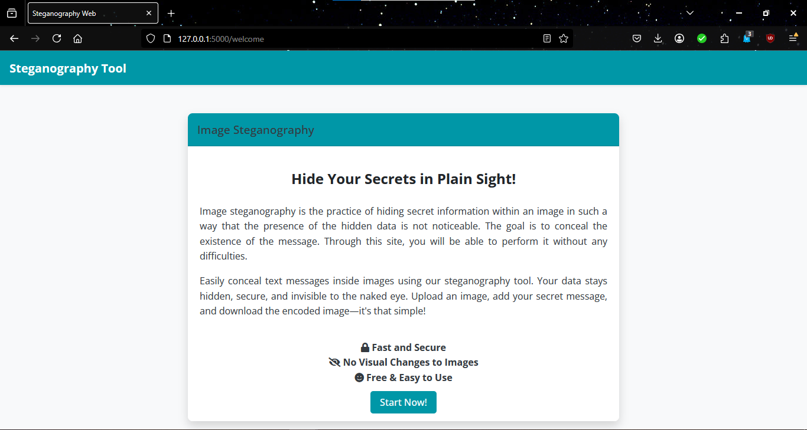
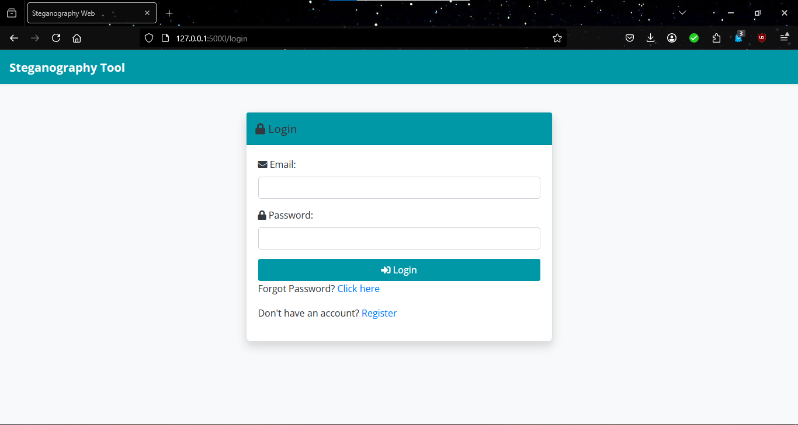
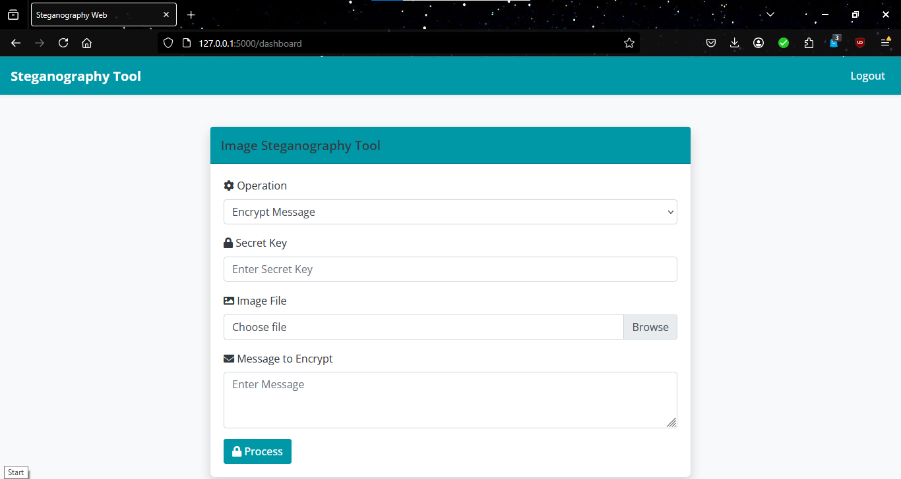
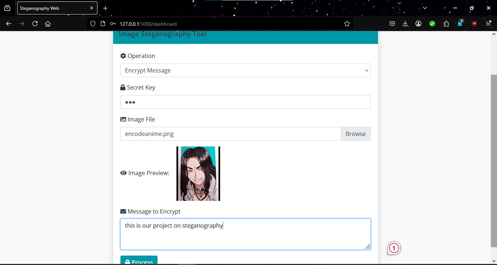
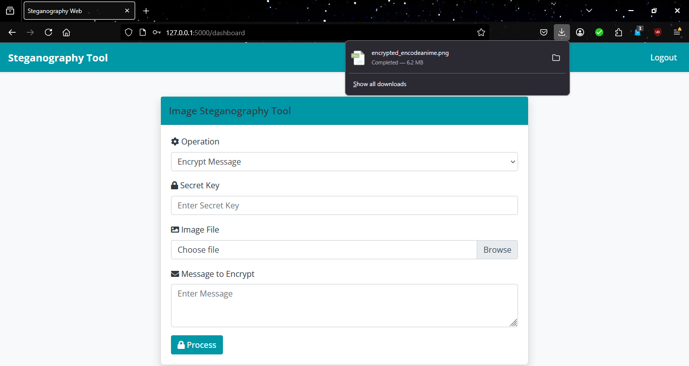
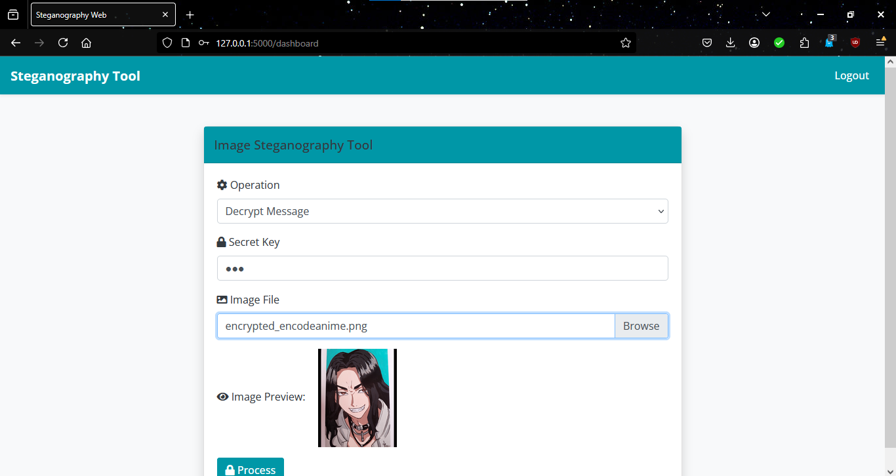
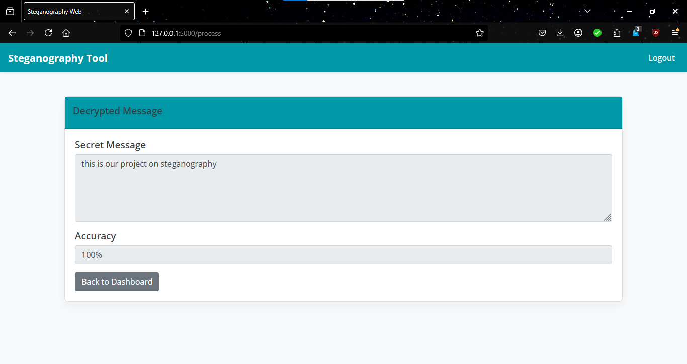

# Image Steganography Tool

A Flask-based web application that hides secret messages inside images using **AES encryption + LSB (Least Significant Bit) steganography**.

The project includes:

- User authentication (Google OAuth + password creation)
- Password reset via email
- Encrypt messages into images
- Decrypt hidden messages from images
- ML-based prediction of message accuracy using a Random Forest model
- SQLite database for user storage

---

# Project Structure

```txt
IMAGE STEGANOGRAPHY/
│
├── __pycache__/
│
├── screenshots/
│      welcome.png
│      login.png
│      dashboard.png
│      encode.png
│      save.png
│      decode.png
│      decoded-image.png
│
├── instance/
│      users.db                  # SQLite database
│
├── models/
│      rf_model.pkl              # Trained ML model
│
├── static/
│      ├── css/
│      │      style.css
│      │
│      └── js/
│             script.js
│
├── templates/
│      base.html
│      create_password.html
│      dashboard.html
│      forgot_password.html
│      login.html
│      register.html
│      reset_password.html
│      result.html
│      welcome.html
│
├── uploads/                     # Uploaded/generated images
│
├── .gitignore
├── app.py                       # Main Flask application
├── config.py                    # Configuration settings
├── requirements.txt
└── README.md
```

---

# Features

### User Authentication
- Google Sign-In
- Password creation after Google login
- Secure password hashing
- Login/logout functionality
- Password reset via email

### Image Steganography
- Encrypt secret messages into images
- AES encryption before embedding
- Decrypt hidden messages using secret key
- Supports PNG/JPG/JPEG images

### Machine Learning
Predicts message accuracy using:

```txt
models/rf_model.pkl
```

The application requires this file to work properly.

---

# Technologies Used

- Python
- Flask
- Flask-SQLAlchemy
- Authlib (Google OAuth)
- Flask-Mail
- Pillow (Image Processing)
- PyCryptodome (AES Encryption)
- SQLite
- Random Forest ML model (.pkl)
- Bootstrap 4
- HTML/CSS/JavaScript

---

# Installation

## 1. Clone repository

```bash
git clone https://github.com/niruja-bhandari/Image-Steganography.git
```

Open project:

```bash
cd Image-Steganography
```

---

## 2. Create virtual environment

Windows:

```bash
python -m venv venv
```

Activate:

```bash
venv\Scripts\activate
```

Mac/Linux:

```bash
python3 -m venv venv

source venv/bin/activate
```

---

## 3. Install dependencies

Run:

```bash
pip install -r requirements.txt
```

If missing packages appear, install:

```bash
pip install authlib flask-mail itsdangerous
```

---

# Running the Project

Run:

```bash
python app.py
```

After running:

A local server link will appear in terminal similar to:

```txt
http://127.0.0.1:5000
```

Click that link or open it in browser.

The application will start.

---

# Required Configuration

Update values in:

## config.py

Replace placeholders:

```python
SECRET_KEY = 'your-secret-key-here'

MAIL_USERNAME = 'your-email@gmail.com'

MAIL_PASSWORD = 'your-app-password'
```

with your actual credentials.

---

## app.py

Replace Google OAuth credentials:

Find:

```python
client_id='your gmail api id'

client_secret='your google secret key'
```

Insert your:

- Google Client ID
- Google Client Secret

---

# Google OAuth Setup

1. Open Google Cloud Console:

https://console.cloud.google.com/

2. Create Project

3. Enable:

- People API

4. Configure OAuth Consent Screen

5. Create OAuth Credentials

Select:

```txt
OAuth Client ID
→ Web Application
```

Add redirect URI:

```txt
http://127.0.0.1:5000/authorize
```

Copy:

- Client ID
- Client Secret

Insert them into:

```python
client_id=
client_secret=
```

---

# Email Password Reset Setup

For Gmail:

Enable:

### 2-Step Verification

Generate:

### Gmail App Password

Use:

```python
MAIL_PASSWORD='your app password'
```

instead of normal Gmail password.

---

# Machine Learning Model

This project uses:

```txt
models/rf_model.pkl
```

Do not remove it.

Without this file:

Prediction accuracy feature will not work.

---

# How to Test

### Register/Login

Create account using Google Sign-In.

---

### Encrypt Message

1. Login

2. Open dashboard

3. Select:

```txt
Encrypt Message
```

4. Upload image

5. Enter:

- Secret key
- Message

6. Click:

```txt
Process
```

Encrypted image downloads automatically.

---

### Decrypt Message

1. Upload encrypted image

2. Enter same secret key

3. Select:

```txt
Decrypt Message
```

4. Click:

```txt
Process
```

Hidden message appears.

---

# Common Errors

### Missing modules

Install requirements:

```bash
pip install -r requirements.txt
```

---

### Google login not working

Check:

```txt
client_id

client_secret

redirect URI
```

---

### Password reset email not sent

Check:

```txt
MAIL_USERNAME

MAIL_PASSWORD
```

Use Gmail App Password.

---

### Incorrect secret key

Encryption and decryption must use:

```txt
same secret key
```

---

# License

MIT License

Free to use and modify.

---

# Author

Developed as an Image Steganography project using Flask, AES encryption, LSB embedding, Google OAuth authentication, and Machine Learning.

---

## Screenshots

### Welcome Page


### Login Page


### Dashboard


### Encode (Encrypt)


### Save Encrypted Image


### Decode (Decrypt)


### Decrypted Message

